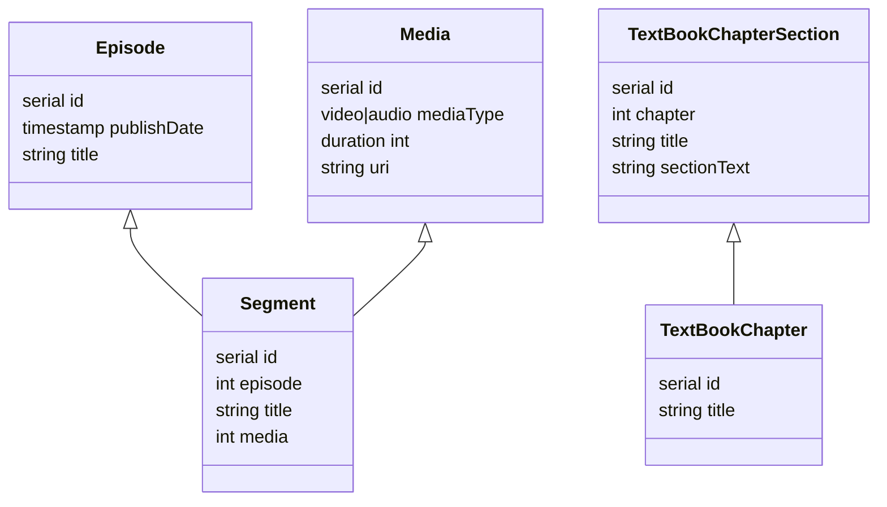
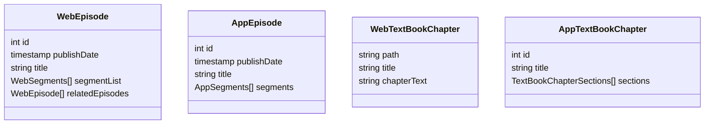

# Existing Datastructure Overview

This is a very simplified overview of the PostgreSQL and Firestore datastructure. PostgreSQL is the primary datasource. We use a service that live-syncs data between PostgreSQL and Firestore in both directions.

Update the diagrams below with the addition of a proposed playlist structure.

## PostgreSQL tables

### Overview
- **Episodes**: Each audio or video episode contains one or more audio or video segments. For instance, an episode "Pharmacology" might contain six video segments on "Overview", "Antibiotic Use", "Meds to Avoid", etc. Each of those segments references a media row.
- **Textbook Chapters**: Textbook chapters are made up of multiple sections of content. Think of the sections like top-level headers within the chapter that then contain all of the content for that section.

### Database Diagram

## Firestore Collections

