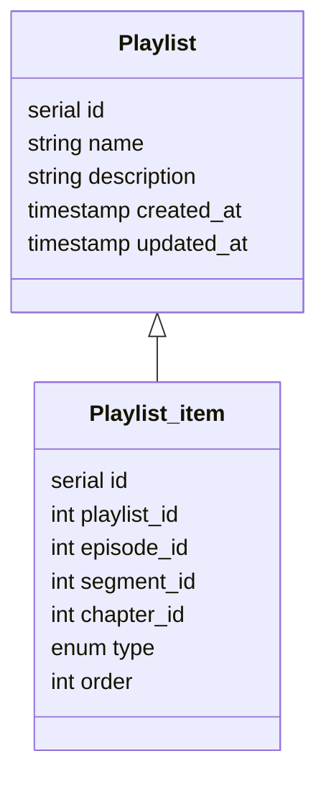
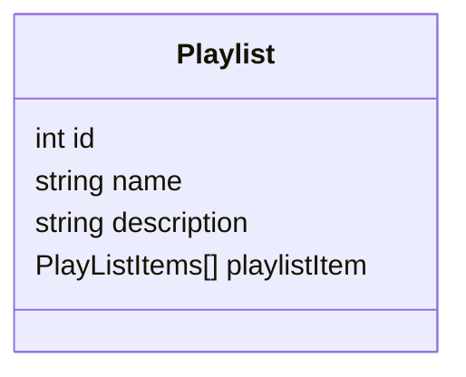
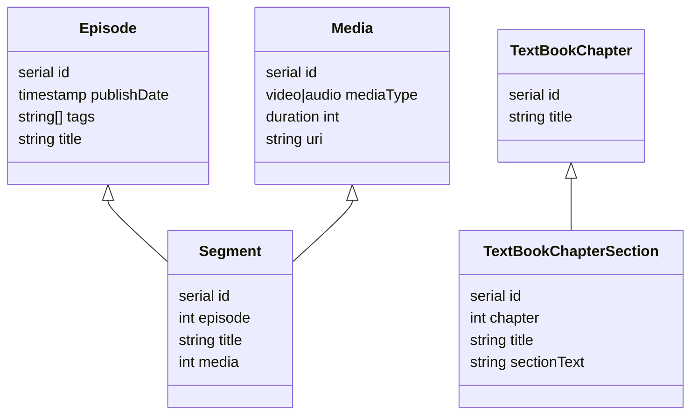
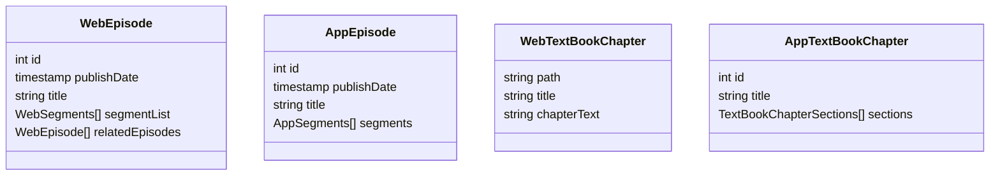

# Existing Datastructure Overview

This is a very simplified overview of the PostgreSQL and Firestore datastructure. PostgreSQL is the primary datasource. We use a service that live-syncs data between PostgreSQL and Firestore in both directions.

Update the diagrams below with the addition of a proposed playlist structure.

## PostgreSQL tables

### Overview
- **Episodes**: Each audio or video episode contains one or more audio or video segments. For instance, an episode "Pharmacology" might contain six video segments on "Overview", "Antibiotic Use", "Meds to Avoid", etc. Each of those segments references a media row.
- **Textbook Chapters**: Textbook chapters are made up of multiple sections of content. Think of the sections like top-level headers within the chapter that then contain all of the content for that section.

### Improvement notes ###
First of all, I added a string array field named "tags" to the Episode table (since PostgreSQL supports arrays). This field helps to easily find relevant episodes and denormalize data in the 'WebEpisode' collection. Then, I assumed that a polymorphic playlist that can have any type of media or textbook added to it and provide a flexible way to sort this content can fulfill the customer's needs. In a real-world scenario, it often happens that a customer wants to add a video segment or text chapter to more than one playlist. So, I came up with two tables: playlist and playlist_items.

The approach of having three columns (episode_id,segment_id,chapter_id) and not using a single column is for adding foriegh key constraint to each of them.

ps:In assumed we modified the foreign key constraint to allow null values by specifying the keyword "NULL" in the foreign key definition.

Finally it can be denormalized into a Firestore collection as follow:

### Database Diagram

## Firestore Collections

